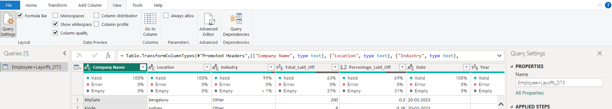
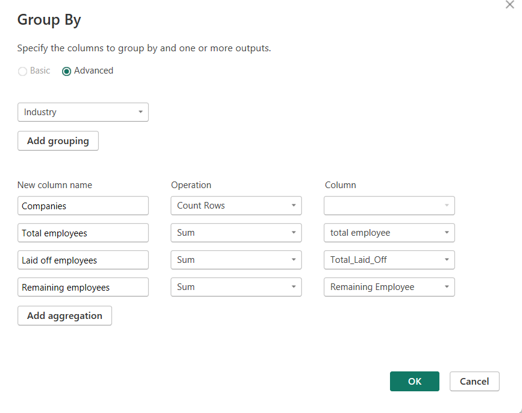
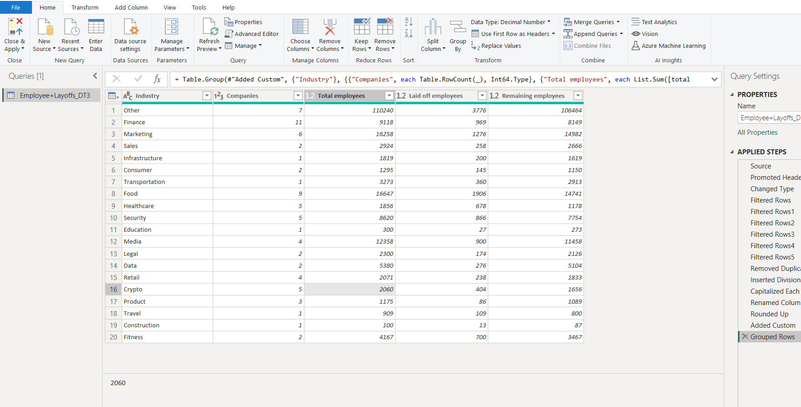

# Powerbi

## notes

- We can change data type onclick of column header (like date)
- we can merge two tables using home => append queries
- we can change values based on other table using home => merge Queries
- Text before delimiter pickes first part
- Text After delimiter pickes second part
- we can use Add Column => column from example to give some patter that eg. That will show other values if we are ok then we can apply transform function
- we can create new column based on new conditions like ratings (good, bad, average) Add Column tab => Conditional column

## Data transforming employee layoff table - You can hover blow column header, to see status of column, if there are some falsie values it will display - Other way is go to View tab and click column quality option

- To Capitalize/lowercase values => goto transform => format =>
- To get total employees => Total laid off / percentage laid off
- To get Remaining employee, Add column => custom column and add formula => total emp - total laid off employee

To create Group to view summarized view
home=> group by

And hit ok it will show result like this

## Data transforming employee layoff table - You can hover blow column header, to see status of column, if there are some falsie values it will display - Other way is go to View tab and click column quality option
